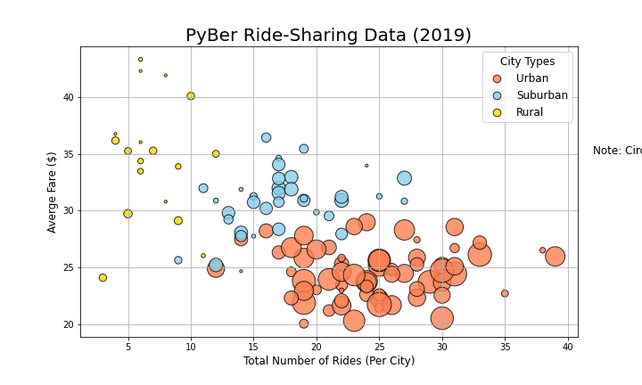
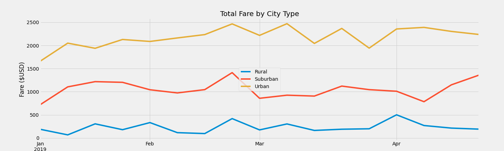

# PyBer_Analysis
## Overview
After presenting our analysis on ride-sharing data to the CEO of Pyber, V. Isualize gave us another assignment to compare ride-sharing data by city type. Specifically looking at total weekly fares for each city type. 

In order to get this information, we had to create a data frame with total rides, total drivers and total shares. We then calculated the average fare per ride and average fare per driver. Once we had this information we were able to choose a time frame to analyze the total fares each week per city type. 

## Results
During our original analysis, we broke down the average fare per ride and average fare per driver. From that information we already know that urban city types have the lowest average fare per ride and average fare per driver. Urban city type also makes the highest amount of total fares for PyBer. This is the opposite for the rural city types, where the average fare per ride and driver are the highest, and total amount of fares from rural city types are the lowest amount. 

You can see that relationship between the different city types and average fare prices below:

### Total Fare by City Type
When we look at the week over week analysis of total fares by city type, we see that rural cities are about 10x lower in total fares each week than urban cities, with suburban cities right in the middle. Urban and suburban cities also follow a similar trend pattern each week, whereas rural cities have a more steady trend and do not follow that similar pattern. 

See below for the total fare comparison by city type:

### In conclusion...
With the above information, we can infer a couple of things:
1. Although urban city types have cheaper fare prices, they provide the highest total fares each week among the three city types.
2. Rural city types require higher fare prices because there are fewer rides each week and that increases the fare per driver cost. 
3. Suburban city types follow similar trends to urban cities but have more of a steady trend in total fares each week.
4. There is a spike in all three city types the last week of Febuary, going into March. 

## Summary
Three business recommendations I would make to the CEO to address any disparities among the cities types:
1. In order to increase total rides in rural cities, I would recommend increasing the number of drivers and lowering the average fare per ride. This would lower the average fare per driver and could in turn, cut ride prices making it more affordable. 
2. With such a high urban demand, I would increase the average fare per ride by cutting the amount of drivers. 
3. Lastly, I would recommend moving the drivers cut from Urban city types over to suburban city types. This would even out average fare prices per ride and driver.
